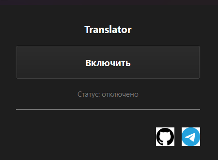
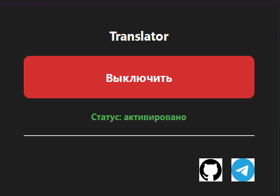

# Translator-GUI
# Описание
Программа которая переводит любые слова/предложения в английский язык. Полезно для тех кому лень заходить в переводичик.

# Инструкция по использованию

1. Запускаешь .exe файл.
2. Нажимаешь на кнопку: Включить.
3. Печатаешь предложение или слово и выделяешь его.
4. Нажимаешь на "Ctrl + X" и ждёшь 1-2 секунды.
5. Оно успешно перевелось!

# Установка для Linux

1. git clone https://github.com/CarinalZ/my.git
  cd Репозиторий - (Склонируйте репозиторий)
2. python3 -m venv venv
   source venv/bin/activate  виртуальное окружение (рекомендуется)
3. pip install PyQt6 deep-translator keyboard pyperclip (Установка зависимостей)
4. python3 Translator.py (Запуск)

# Скриншоты

# Соц. сети:
- Telegram: https://t.me/carinalproject
- GitHub: https://github.com/CarinalZ
